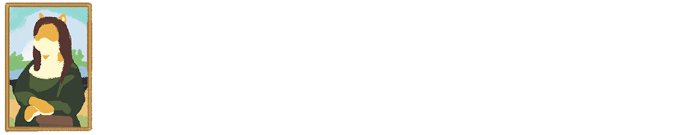
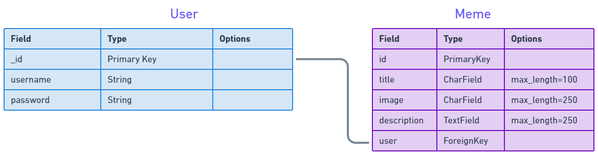

# [Click here to check out Meme Museum!](https://meme-museum.fly.dev/)

## Getting Started
1. Visit Meme Museum [here](https://meme-museum.fly.dev/)
2. Log in or Sign up to access the Gallery or Create a meme.
3. Click on "Create" to make your very own doge meme!
4. Click on "Gallery" to view other's submissions!
5. Click on "Upload" to contribute to the gallery!

## Highlight
<p>Meme Museum uses jquery to add a event listener to a HTML canvas. This feature allows the user to dynamically create a new meme only using HTML + JS.</p>

```
function handleLoadImg () {
    context.drawImage(image, 0, 0, 500, 300)
    image.removeEventListener('load', handleLoadImg)
}

function genImage () {
    $.ajax('https://dog.ceo/api/breed/shiba/images/random').done(function(data) {
    shibeImage = data.message
    image.src=shibeImage
    image.addEventListener('load', handleLoadImg)
})
}
```

## Technologies Used
- HTML
- CSS
- Python
- JavaScript
- AJAX
- JQuery
- Django
- Bit.io
- AWS
- Docker
- Photoshop CS 2023
- Whimsical

## ERD


## IceBox

## Attributions
- [Dog.ceo Dog API](https://dog.ceo/dog-api/)
- [bit.io SQL Database](https://bit.io/)
- [fly.io App Deployment](https://fly.io/)
- [Whimsical](https://whimsical.com/)
- [Amazon AWS S3](https://aws.amazon.com/s3/)
- [Fontworks Yuruka STD](https://en.fontworks.co.jp/)